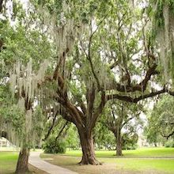

# Session 15A Assignment:

## Dataset Link:
You can download the complete dataset from the google drive link below    
[Dataset Download Link](https://drive.google.com/file/d/1w_5-yxq-blACNahl1moMzSuSf3z8DSAb/view?usp=sharing)  
Filename: image_dataset.zip

## Background Images
     

## Foreground Images
     

## Foreground Mask Images
     

## Generated Images (superimpose foreground on background image)
     

## Masks for Generated Images 
     

## Depthmap for Generated Images
     

## How it is created
* Background images (bg) : Downloaded from internet, resized to 220x220. --> 100 Images
* Foreground images (fg) : Downloaded from internet with mostly transparent images, removed the background using powerpoint, resized to 110x110. --> 100 Images
* Foreground Mask images (fg_mask) : This is created using code, also gimp video is available,
It will create the masks for the foreground --> 100 Images

Generated images:
Then used Dataset Generation notebook, uploaded the created images to gdrive and used.

This code takes created images as the input and create superimpose foreground images on the background. Each foreground images (total 100) and flipped (now total 200) are superimposed 20 times randomly on background images, so 200x20x100 = 400k images.
Also it will create respective 400k mask images.

Depthmap images:
These are generated using depthmap model, code is available. --> 400k Images

https://github.com/ialhashim/DenseDepth

### Dataset Statistics ###
| Image Type  | Mean | Standard Deviation |
| ----------- | ---------- | ---------------- |
| Generated Image  | [0.50169254 0.51531572 0.38720035] | [0.25096876 0.2417532 0.28520041]  |
| Generated Image Mask  | [0.09301607 0.09301607 0.09301607]  |  [0.28483643 0.28483643 0.28483643] |
| Depthmap Image   | [0.34092307 0.34092307 0.34092307]  | [0.23391564 0.23391564 0.23391564]  |

###  ###
