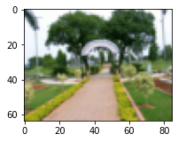
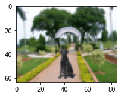
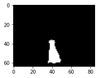
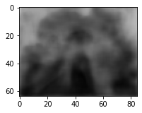
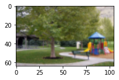
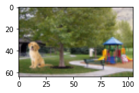
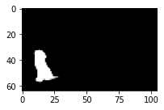
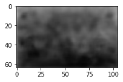

# Session 15 Assignment

Here our network will take two input images - image with foreground object + background and image with only background. The output will be the mask for the foreground object in the image and the depthmap of the image.

### Model link:

[Predict Mask and Depthmap Model Download Link](https://drive.google.com/file/d/15hvGSwYbz_ChiRo89zydrm8aoABLjcJ7/view?usp=sharing) <br/>

```python

from utils import predict

## arguments:
## modelpath - the absolute path for model file
## filepath - the absolute path for test image files
## bg - the filename for background image
## image - the filename for image

predict.predict_images(modelpath, filepath, bg,  image)
```
[Sample Usage Code](S15_SamplePredict.ipynb)

### Results ###

|    Epocs     |  Mask Dice Score   |    Depthmap Dice Score  |
| ---------------- | -------------- | ------------------ |
| 28 |   0.91 |  0.43 |

The following predicted images were generated with input images that network has never seen.

|    Background (Input)     |     Image (Input)    |    Predicted Mask (Output)  | Predicted Depthmap (Output) |
| ---------------- | ---------------- | -------------- | ------------------ |
|   |   |   |   |
|   |   |   |   |

## Solution

The approach is build RESNET architecture to predict the output images rather than labels.

[Solution Code](S15_Mask_and_Depthmap_Prediction.ipynb)

The dataset has background images - park images, foreground images & respective masks - dog images, generated images & respective masks - this is done via superimposing, and finally depthmap images.

# Data 

Images to converted to 64*64 for training, and built a custom dataset class which read files using getitem.

Also the mask images are converted to grayscale for further optimize.

[Datagenerator Code](utils/dataprep.py)

### Model

It has the total of 3,199,552 parameters and its based on RESNET architecture.

|    Layer     | #Input Channels    |    #Output Channels |
| ------------ | ------------------ | ------------------- |
| Image Preparation Layer (Image) | 3 |  32 |
| Image Preparation Layer (Background) | 3 |  32 |
| Resnet Block 1 (Image) | 32 |  64 |
| Resnet Block 2 (Image) | 64 | 128 |
| Sequential Block 1 (Background Image) | 32 | 64 |
| Sequential Block 2 (Background Image) | 64 | 128 |
| Concatenation | 128 * 2  |  256 | |
| Mask Head | 256 |  1  |
| Depthmap Head | 256  |  1 |

[DNN Code](model/dnn.py)

### Loss Function

There is two loss functions here, one for predict the masks and the other for predict the depthmaps.

Finally weighted average of two loss functions been used as mask trains easily.

```
w1 - weightage for mask loss
w2 - weightage for depthmap loss

loss = (w1 * mask_loss) + (w2 * depthmap_loss)

```
[Custom Loss Code](utils/customloss.py)

#### Loss Function for Mask
I used BCEWithLogitsLoss for the mask prediction

#### Loss Function for Depthmap
I used a custom loss funciton for depthmap prediction. The custom loss function had 3 components, and is calculated as follows:

```
loss_pixel = Pixel wise loss
loss_edge = Edge loss
loss_ssim = Loss calculated based on Structural Similarity (SSIM)

depthmap_loss = (w1 * loss_pixel) + (w2 * loss_edge) + (w3 * loss_ssim) 

```

### Training & Evaluation 
I used DICE score for evaluation of the predicted images. I trained the network for 25 epocs.

[Dice Score Code](utils/dice.py)

### Challenges & Constrains
The size of the dataset was the biggest challenge, hence I had to train the network on images of resolution 64 x 64. The original image size is 220 x 220


## Reference
* Dice Score Calculation: https://github.com/milesial/Pytorch-UNet
* Gradient Calculation in Pytorch: https://discuss.pytorch.org/t/how-to-calculate-the-gradient-of-images/1407/6
* Monocular Depth Estimation: https://github.com/ialhashim/DenseDepth
* https://towardsdatascience.com/metrics-to-evaluate-your-semantic-segmentation-model-6bcb99639aa2
* SSIM: https://github.com/Po-Hsun-Su/pytorch-ssim
